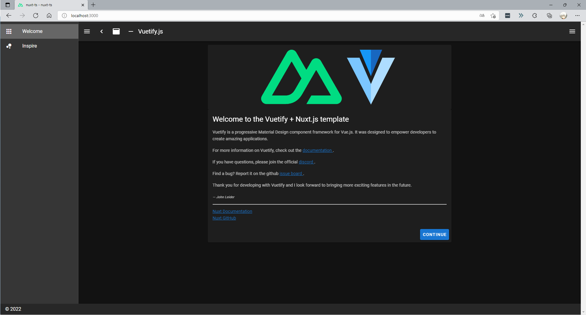

# Nuxt✕TypeScriptのチュートリアルアプリ

NuxtをTypeScriptで実装するアプリ

# 基本設定

まずは以下のコマンドを入力する。

```
npm init nuxt-app nuxt-ts
```

## プロジェクト設定

Nuxtのプロジェクトをつくる際に様々な命令が出るので、その実装方法を以下に示す。

```
create-nuxt-app v4.0.0
✨  Generating Nuxt.js project in nuxt-ts
? Project name: nuxt-ts
? Programming language: TypeScript
? Package manager: Npm
? UI framework: Vuetify.js
? Nuxt.js modules: Axios - Promise based HTTP client
? Linting tools: (Press <space> to select, <a> to toggle all, <i> to invert selection)
? Testing framework: None
? Rendering mode: Universal (SSR / SSG)
? Deployment target: Server (Node.js hosting)
? Development tools: (Press <space> to select, <a> to toggle all, <i> to invert selection)
? What is your GitHub username? shota-nukumizu
? Version control system: Git
```

## 開発者サーバ立ち上げ

Nuxtのプロジェクトが完成したら、以下のコマンドを入力してNuxtサーバを立ち上げる。

```
cd nuxt-ts
npm run dev
```

`http://localhost:3000/`が出力されていたら成功。


# TypeScriptの導入

以下のコマンドでインストール

```
npm install --save-dev @nuxt/typescript-build @nuxt/types
```

# 設定

`nuxt.config.js`内の`buildModules`に`@nuxt/typescript-build`を追加すること。

```js
export default {
    buildModules: ['@nuxt/typescript-build']
}
```

そして、以下に`tsconfig.json`を用意する。

```json
{
  "compilerOptions": {
    "target": "ES2018",
    "module": "ESNext",
    "moduleResolution": "Node",
    "lib": [
      "ESNext",
      "ESNext.AsyncIterable",
      "DOM"
    ],
    "esModuleInterop": true,
    "allowJs": true,
    "sourceMap": true,
    "strict": true,
    "noEmit": true,
    "baseUrl": ".",
    "paths": {
      "~/*": [
        "./*"
      ],
      "@/*": [
        "./*"
      ]
    },
    "types": [
      "@types/node",
      "@nuxt/types"
    ]
  },
  "exclude": [
    "node_modules"
  ]
}
```

また、以下の型宣言を追加して、Vueファイルの型を提供する必要がある。

```ts
// vue-shim.d.ts
declare module "*.vue" {
    import Vue from 'vue'
    export default Vue
}
```

このファイルはルートディレクトリに配置する。(新規作成する必要がある)

# Runtimeのインストール

インストールコマンド

```
npm install @nuxt/typescript-runtime
```

`package.json`を更新。

```json
"scripts": {
  "dev": "nuxt-ts",
  "build": "nuxt-ts build",
  "generate": "nuxt-ts generate",
  "start": "nuxt-ts start"
},
"dependencies": {
  "@nuxt/typescript-runtime": "latest",
  "nuxt": "latest"
},
"devDependencies": {
  "@nuxt/types": "latest",
  "@nuxt/typescript-build": "latest"
}
```

これで`nuxt.config.js`、ローカルの`modules`や`serverMiddleware`でTypeScriptを動かせる。基本設定は終了。

# 完成デモ

▼初期設定画面



# 開発環境

* Nuxtjs 4.0.0
* Vuetify 2.6.2
* Axios
* TypeScript 4.5.4